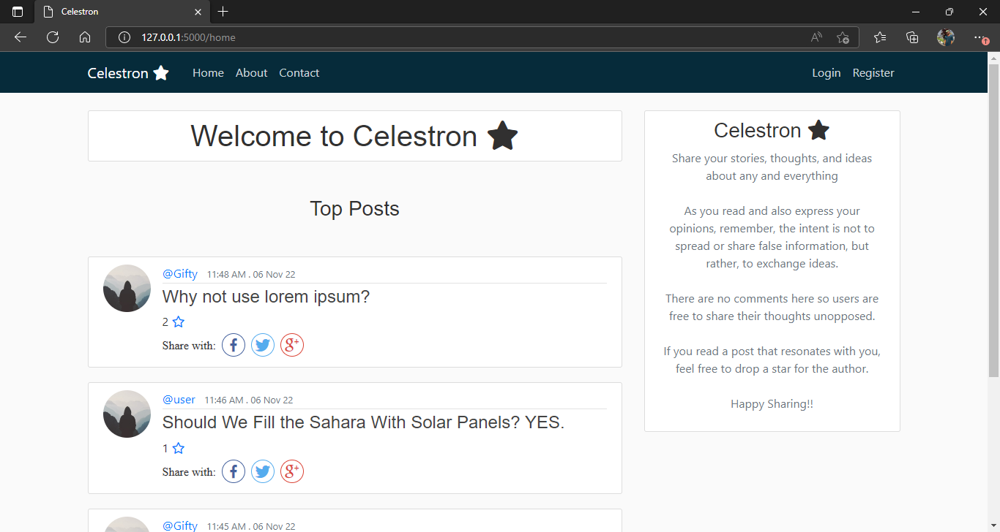

# Celestron

## Aim
<<<<<<< HEAD
Using [Python](https://www.python.org/), [Flask](https://flask.palletsprojects.com/en/2.2.x/), and [PostgreSQL](https://www.postgresql.org) to build a simple blogging website.

## Concept
Celestron is a simple open-source platform where users can share thoughts, ideas, and stories about any and everything.
Anyone can read articles from all or specific users, but the user has to create an account and be logged in if the intent is to create or star a post.    
=======
Using [Python](https://www.python.org/) and [Flask](https://flask.palletsprojects.com/en/2.2.x/) to build a simple blogging website.

## Concept
A simple open-source platform where users can share thoughts, ideas, and stories about any and everything.
Anyone can read articles from all or specific users, but the user has to create an account and be logged in if the intent is to post, update a post, or drop a star.    
>>>>>>> cedce2c9ffb76c33a0c93a7245388eed3f713079

Celestron was built as an exam project by [Alexander](https://github.com/Anyaegbunam-Alexander), a Backend Engineering student of [AltSchool Africa](https://www.altschoolafrica.com/).

## Built With
- [Python](https://www.python.org/)
- [Flask](https://flask.palletsprojects.com/en/2.2.x/)
- [Jinja](https://jinja.palletsprojects.com/en/3.1.x/)
- HTML
- CSS
- [PostgreSQL](https://www.postgresql.org)
- [Bootstrap](https://getbootstrap.com/)
- [Font Awesome](https://fontawesome.com)

## Sample Page


## Installation
Install with pip:
```
$ pip install -r requirements.txt
```

## Environment Configuration

### .env configuration
Create a .env file with these configurations:
```
FLASK_ENV=development
FLASK_DEBUG=<True/False>
FLASK_APP=app.py
SECRET_KEY=<your secret key>
DATABASE_HOSTNAME=<database hostname>
DATABASE_PORT=<database port>
DATABASE_PASSWORD=<database password>
DATABASE_NAME=<database name>
DATABASE_USERNAME=<database username>
SQLALCHEMY_TRACK_MODIFICATIONS=False
MAIL_USERNAME=<email username>
MAIL_PASSWORD=<email password>
```
`app.py` is Celestron's entry point.  
This file contains just one route pointing to the home page.

## Run Flask
In the terminal:
```
 flask run
```
In Flask, the default port is 5000  

Entry point: http://127.0.0.1:5000

## Note
- Some `\_\_init\_\_.py` files might be empty.  
Those are just to specify that those folders are packages.
- To send password reset emails, uncomment the codes commented out.

## Contact
- Mail: alexanderking.aa@gmail.com
- GitHub: [Alexander](https://github.com/Anyaegbunam-Alexander)

## Acknowledgements
- [AltSchool Africa](https://www.altschoolafrica.com/)
- [Caleb Emelike](https://github.com/CalebEmelike)
- [Stack Overflow](https://stackoverflow.com/)
